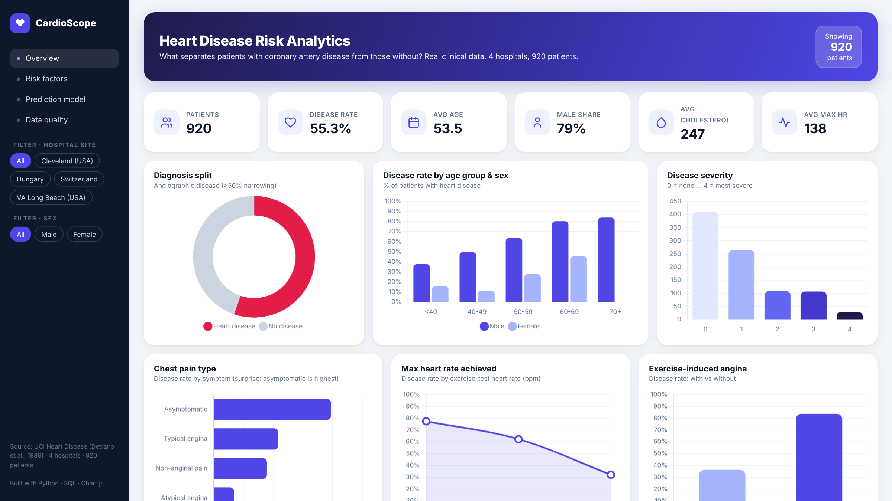
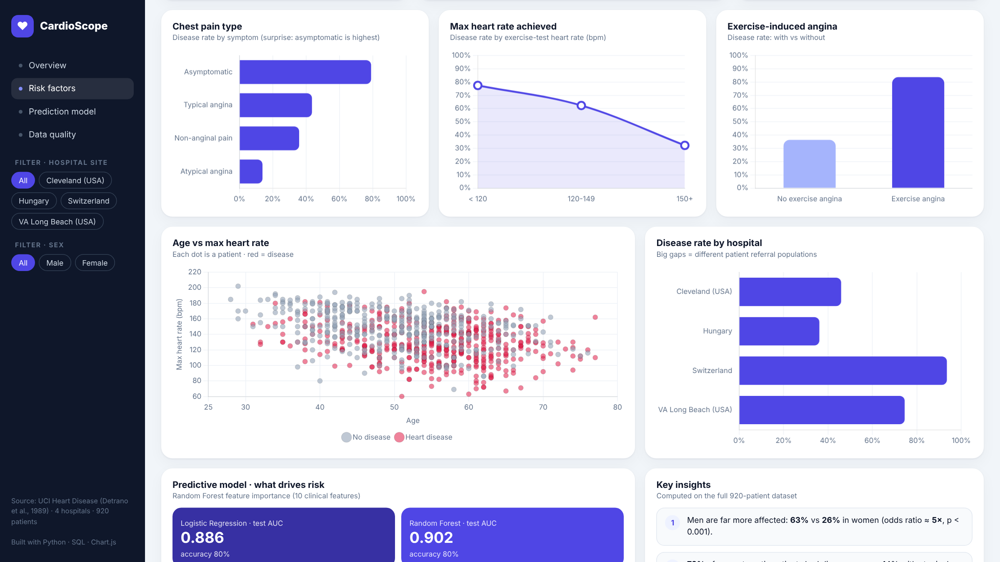
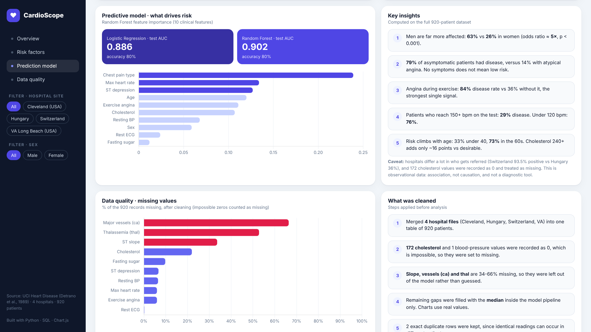

# Heart Disease Risk Analytics

End-to-end data analysis project on **real clinical data**: what separates patients with coronary artery disease from those without? Python cleaning and statistics, a SQL layer, a predictive model, and an interactive BI-style dashboard.

**Live dashboard:** https://abderhman213.github.io/heart-disease-risk-analysis/

[](https://abderhman213.github.io/heart-disease-risk-analysis/)

| Risk factors | Model and data quality |
|---|---|
|  |  |

Full-page view: [images/dashboard.png](images/dashboard.png)

## Data
The cleaned dataset behind the dashboard is available as Excel: [data/Heart_Disease_Data.xlsx](data/Heart_Disease_Data.xlsx) (clean data, raw combined data, field guide), plus CSV and SQLite versions in `data/`.

UCI Heart Disease dataset (Detrano et al., 1989): 920 patients from four hospitals (Cleveland, Hungary, Switzerland, VA Long Beach), 13 clinical attributes. Target: angiographic disease (>50% vessel narrowing). Source: https://archive.ics.uci.edu/dataset/45/heart+disease

## Workflow
1. **Cleaning (pandas):** merged four site files, treated `?` as missing, found 172 impossible cholesterol values (0) and 1 blood pressure value of 0, converted them to missing, created age/cholesterol/BP/heart-rate bands and readable labels.
2. **SQL (SQLite):** 11 queries in `src/queries.sql` (prevalence by site, sex, age, chest pain, exercise angina, cholesterol, blood pressure, heart rate, sex x age).
3. **Statistics:** Mann-Whitney U for numeric variables, chi-square for categorical, odds ratio for sex.
4. **Modeling:** logistic regression and random forest, 5-fold CV plus held-out test set, median imputation.
5. **Excel export:** `src/03_build_excel.py` writes the exact dataset used by the dashboard to Excel.
6. **Dashboard:** interactive HTML (Chart.js, filters by hospital and sex). A Power BI rebuild guide is in `docs/POWERBI_GUIDE.md`.

## Key findings
- 55.3% of patients had heart disease. Men: 63.2%, women: 25.8% (odds ratio about 4.95).
- Asymptomatic chest pain had the highest disease rate (79%), atypical angina the lowest (14%).
- Exercise-induced angina: 83.7% disease rate versus 36.4% without.
- Max heart rate 150+ bpm: 28.9% disease; under 120 bpm: 76.1%.
- Disease rate rises with age: 32.5% under 40, 73.4% in the 60s.
- Models: logistic regression test AUC 0.886, random forest 0.902 (accuracy about 80%). Chest pain type, max heart rate and ST depression were the top features.

## Limitations
Hospitals differ strongly in referral populations (Switzerland 93.5% positive vs Hungary 36.1%), so site is a confounder. Results show association, not causation, and this is not a diagnostic tool.

## Run it
```
pip install -r requirements.txt
python src/01_clean_and_analyze.py   # needs the UCI files in raw/
python src/02_build_dashboard.py
```
Raw UCI files: download the zip from the link above and extract into `raw/`.

Author: Abderhman Medhat, Bioinformatics (AI) student and aspiring data analyst.
